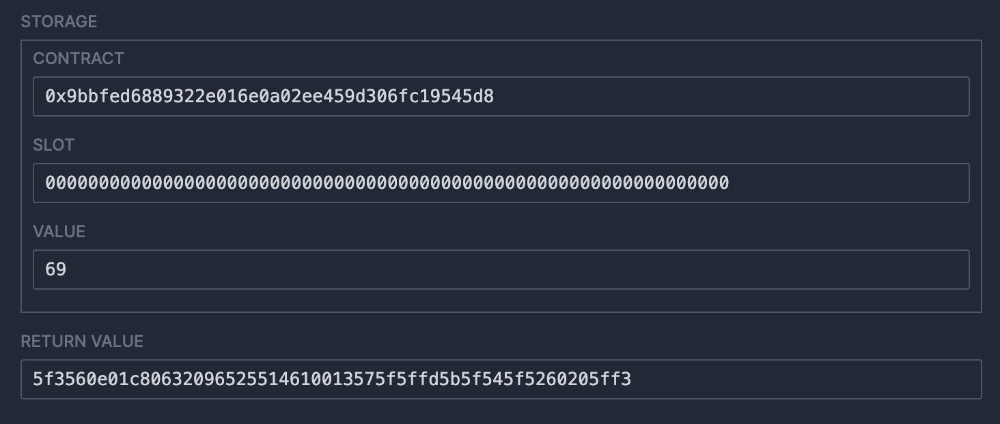

# WTF Huff极简入门: 10. Constructor

我最近在重新学Huff，巩固一下细节，也写一个“Huff极简入门”，供小白们使用（编程大佬可以另找教程），每周更新1-3讲。

推特：[@0xAA_Science](https://twitter.com/0xAA_Science)

社区：[Discord](https://discord.gg/5akcruXrsk)｜[微信群](https://docs.google.com/forms/d/e/1FAIpQLSe4KGT8Sh6sJ7hedQRuIYirOoZK_85miz3dw7vA1-YjodgJ-A/viewform?usp=sf_link)｜[官网 wtf.academy](https://wtf.academy)

所有代码和教程开源在github: [github.com/AmazingAng/WTF-Huff](https://github.com/AmazingAng/WTF-Huff)

-----

这一讲，我们介绍Huff中的`Constructor`，它可以在部署时用来初始化合约。

## Constructor

Huff中的`CONSTRUCTOR`宏和Solidity的构造函数类似，它不是必须的，但是可以在部署时用来初始化合约状态变量。如果你不了解以太坊是如何通过交易创建合约的，可以阅读[WTF EVM Opcodes第21讲](https://github.com/WTFAcademy/WTF-EVM-Opcodes/tree/main/21_Create)。

在下面的例子中，我们使用`CONSTRUCTOR`宏在合约部署时将存储槽`VALUE_LOCATION`的值初始化为`0x69`。

```c
/* 接口 */
#define function getValue() view returns (uint256)

/* 存储槽位 */
#define constant VALUE_LOCATION = FREE_STORAGE_POINTER()

/* 方法 */
// Constructor
#define macro CONSTRUCTOR() = takes (0) returns (0) {
    0x69
    [VALUE_LOCATION]
    sstore              // []
}

#define macro GET_VALUE() = takes (0) returns (0) {
    // 从存储中加载值
    [VALUE_LOCATION]   // [ptr]
    sload                // [value]

    // 将值存入内存
    0x00 mstore

    // 返回值
    0x20 0x00 return
}

// 合约的主入口，判断调用的是哪个函数
#define macro MAIN() = takes (0) returns (0) {
    // 通过selector判断要调用哪个函数
    0x00 calldataload 0xE0 shr
    dup1 __FUNC_SIG(getValue) eq get jumpi
    // 如果没有匹配的函数，就revert
    0x00 0x00 revert

    get:
        GET_VALUE()
}
```


## 分析合约字节码

我们可以使用`huffc`命令获取上面合约的creation code:

```shell
huffc src/10_Constructor.huff -b
```

打印出的bytecode为：

```
60695f55601c80600d3d393df35f3560e01c80632096525514610013575f5ffd5b5f545f5260205ff3
```

将这段字节码复制到[evm.codes playground](https://www.evm.codes/playground?fork=shanghai)，并点击运行。可以看到存储槽`0`被初始化为`69`，并且返回了合约的runtime code: `5f3560e01c80632096525514610013575f5ffd5b5f545f5260205ff3`，说明合约初始化成功！



## 总结

这一讲，我们介绍了如何在Huff中使用`Constructor`宏，它与Solidity中的构造函数类似，可以在部署时用来初始化合约。