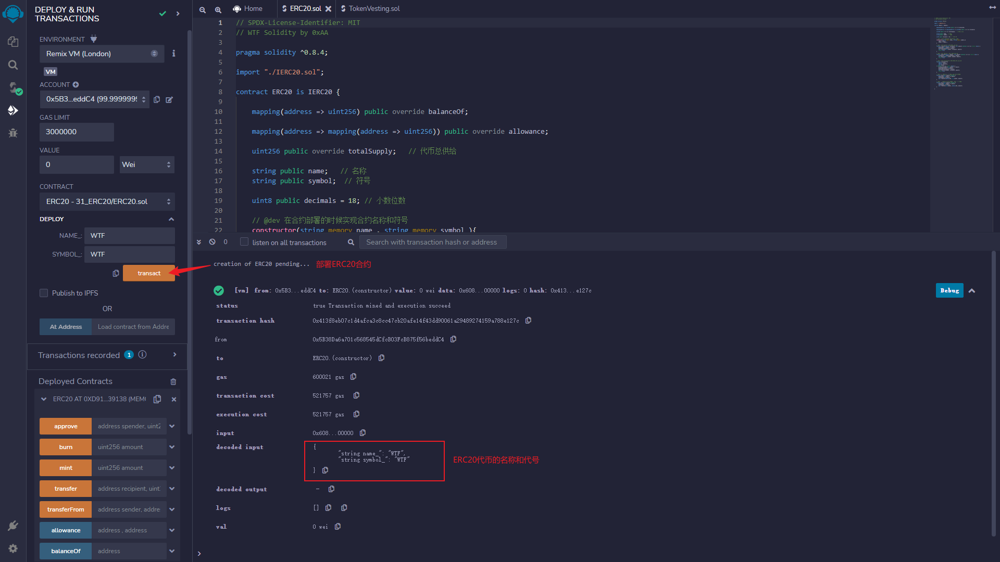
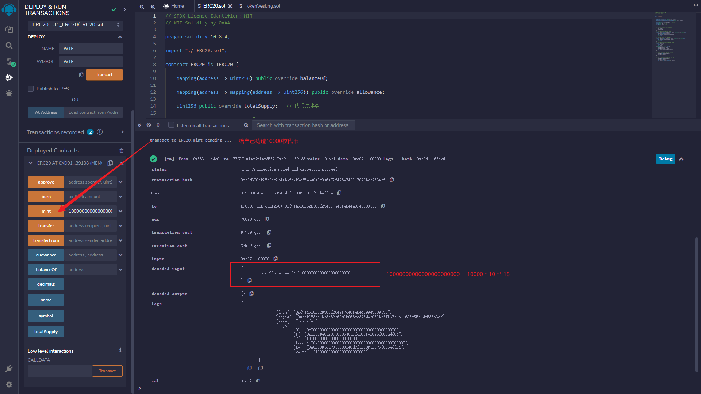
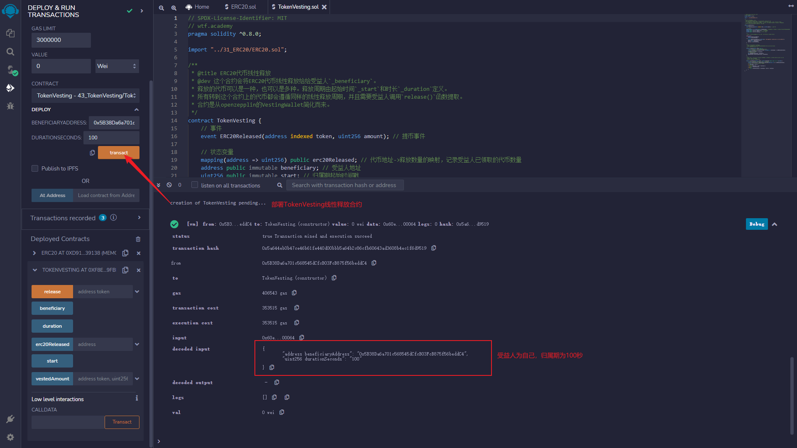
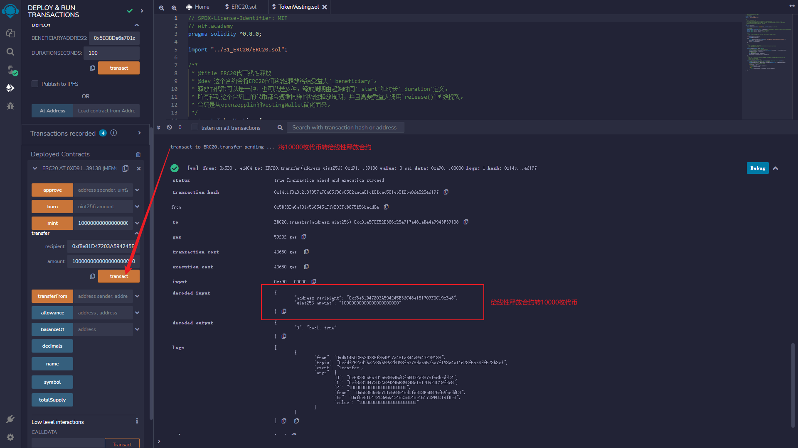
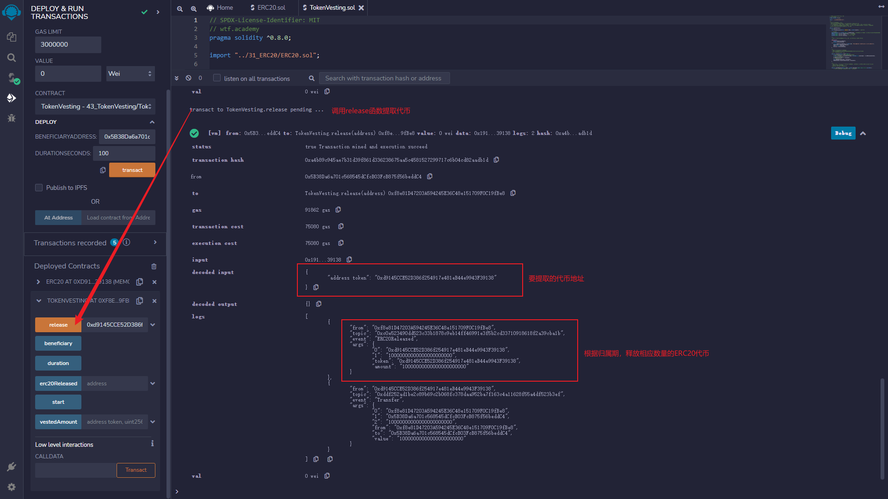

# Solidity极简入门: 43. 线性释放

我最近在重新学solidity，巩固一下细节，也写一个“Solidity极简入门”，供小白们使用（编程大佬可以另找教程），每周更新1-3讲。

推特：[@0xAA_Science](https://twitter.com/0xAA_Science)

社区：[Discord](https://discord.wtf.academy)｜[微信群](https://docs.google.com/forms/d/e/1FAIpQLSe4KGT8Sh6sJ7hedQRuIYirOoZK_85miz3dw7vA1-YjodgJ-A/viewform?usp=sf_link)｜[官网 wtf.academy](https://wtf.academy)

所有代码和教程开源在github: [github.com/AmazingAng/WTFSolidity](https://github.com/AmazingAng/WTFSolidity)

-----

这一讲，我们将介绍代币归属条款，并写一个线性释放`ERC20`代币的合约。代码由`OpenZepplin`的`VestingWallet`合约简化而来。

## 代币归属条款


在传统金融领域，一些公司会向员工和管理层提供股权。但大量股权同时释放会在短期产生抛售压力，拖累股价。因此，公司通常会引入一个归属期来延迟承诺资产的所有权。同样的，在区块链领域，`Web3`初创公司会给团队分配代币，同时也会将代币低价出售给风投和私募。如果他们把这些低成本的代币同时提到交易所变现，币价将被砸穿，散户直接成为接盘侠。

所以，项目方一般会约定代币归属条款（token vesting），在归属期内逐步释放代币，减缓抛压，并防止团队和资本方过早躺平。

## 线性释放

线性释放指的是代币在归属期内匀速释放。举个例子，某私募持有365,000枚`ICU`代币，归属期为1年（365天），那么每天会释放1,000枚代币。

下面，我们就写一个锁仓并线性释放`ERC20`代币的合约`TokenVesting`。它的逻辑很简单：

- 项目方规定线性释放的起始时间、归属期和受益人。
- 项目方将锁仓的`ERC20`代币转账给`TokenVesting`合约。
- 受益人可以调用`release`函数，从合约中取出释放的代币。

### 事件
线性释放合约中共有`1`个事件。
- `ERC20Released`：提币事件，当受益人提取释放代币时释放。

```solidity

contract TokenVesting {
    // 事件
    event ERC20Released(address indexed token, uint256 amount); // 提币事件
```

### 状态变量
线性释放合约中共有`4`个状态变量。
- `beneficiary`：受益人地址。
- `start`：归属期起始时间戳。
- `duration`：归属期，单位为秒。
- `erc20Released`：代币地址->释放数量的映射，记录受益人已领取的代币数量。

```solidity
    // 状态变量
    mapping(address => uint256) public erc20Released; // 代币地址->释放数量的映射，记录已经释放的代币
    address public immutable beneficiary; // 受益人地址
    uint256 public immutable start; // 起始时间戳
    uint256 public immutable duration; // 归属期
```

### 函数
线性释放合约中共有`3`个函数。

- 构造函数：初始化受益人地址，归属期(秒), 起始时间戳。参数为受益人地址`beneficiaryAddress`和归属期`durationSeconds`。为了方便，起始时间戳用的部署时的区块链时间戳`block.timestamp`。
- `release()`：提取代币函数，将已释放的代币转账给受益人。调用了`vestedAmount()`函数计算可提取的代币数量，释放`ERC20Released`事件，然后将代币`transfer`给受益人。参数为代币地址`token`。
- `vestedAmount()`：根据线性释放公式，查询已经释放的代币数量。开发者可以通过修改这个函数，自定义释放方式。参数为代币地址`token`和查询的时间戳`timestamp`。

```solidity
    /**
     * @dev 初始化受益人地址，释放周期(秒), 起始时间戳(当前区块链时间戳)
     */
    constructor(
        address beneficiaryAddress,
        uint256 durationSeconds
    ) {
        require(beneficiaryAddress != address(0), "VestingWallet: beneficiary is zero address");
        beneficiary = beneficiaryAddress;
        start = block.timestamp;
        duration = durationSeconds;
    }

    /**
     * @dev 受益人提取已释放的代币。
     * 调用vestedAmount()函数计算可提取的代币数量，然后transfer给受益人。
     * 释放 {ERC20Released} 事件.
     */
    function release(address token) public {
        // 调用vestedAmount()函数计算可提取的代币数量
        uint256 releasable = vestedAmount(token, uint256(block.timestamp)) - erc20Released[token];
        // 更新已释放代币数量   
        erc20Released[token] += releasable; 
        // 转代币给受益人
        emit ERC20Released(token, releasable);
        IERC20(token).transfer(beneficiary, releasable);
    }

    /**
     * @dev 根据线性释放公式，计算已经释放的数量。开发者可以通过修改这个函数，自定义释放方式。
     * @param token: 代币地址
     * @param timestamp: 查询的时间戳
     */
    function vestedAmount(address token, uint256 timestamp) public view returns (uint256) {
        // 合约里总共收到了多少代币（当前余额 + 已经提取）
        uint256 totalAllocation = IERC20(token).balanceOf(address(this)) + erc20Released[token];
        // 根据线性释放公式，计算已经释放的数量
        if (timestamp < start) {
            return 0;
        } else if (timestamp > start + duration) {
            return totalAllocation;
        } else {
            return (totalAllocation * (timestamp - start)) / duration;
        }
    }
```

## `Remix`演示

### 1. 部署[第31讲](../31_ERC20/readme.md)中的`ERC20`合约，并给自己铸造`10000`枚代币。





### 2. 部署`TokenVesting`线性释放合约，受益人设为自己，归属期设为`100`秒。



### 3. 将`10000`枚`ERC20`代币转给线性释放合约。



### 4. 调用`release()`函数提取代币。



## 总结

代币短期大量解锁会对币价造成巨大压力，而约定代币归属条款可以缓解抛压，并防止团队和资本方过早躺平。这一讲，我们介绍了代币归属条款，并写了线性释放`ERC20`代币的合约。


